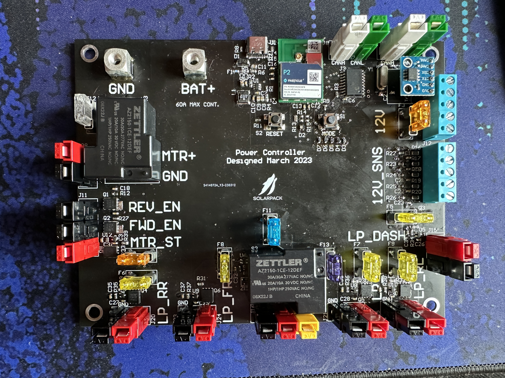

# DecentralizedLV-PowerController
Software Repository for Power Controller Board

## Project Overview

The DecentralizedLV Power Controller has the primary role of managing the power state of the vehicle and supplying power to all of the boards in the DecentralizedLV system. See the main [DecentralizedLV-Documentation](https://github.com/matthewpanizza/DecentralizedLV-Documentation) repository for information about the DecentralizedLV system and how to set up the software environment for programming this board.

## Block Diagram

#### Hardware Capabilities
- 5X Non-PWM [Driver pins](https://github.com/matthewpanizza/DecentralizedLV-Documentation?tab=readme-ov-file#low-power-output-pins-supply-power-to-low-power-devices-less-than-5-amps) (P-MOSFET Configuration) for powering 4 Driver Boards and [Dash Controller](#dash-controller-photon-microcontroller)
- 3X Non-PWM [Driver pins](https://github.com/matthewpanizza/DecentralizedLV-Documentation?tab=readme-ov-file#low-power-output-pins-supply-power-to-low-power-devices-less-than-5-amps) (P-MOSFET Configuration) for indicating direction on the motor controller
- 1X [High-power driver pin](https://github.com/matthewpanizza/DecentralizedLV-Documentation?tab=readme-ov-file#high-power-output-pins-supply-power-to-high-power-devices-greater-than-5-amps) for powering the motor controller
- 1X [High-power driver pins](https://github.com/matthewpanizza/DecentralizedLV-Documentation?tab=readme-ov-file#high-power-output-pins-supply-power-to-high-power-devices-greater-than-5-amps) for powering the Battery Management System
- 5X [Sense Pins](https://github.com/matthewpanizza/DecentralizedLV-Documentation?tab=readme-ov-file#sense-pins-read-binary-onoff-switches-or-12v-signals) (4:1 voltage divider ratio) for sensing brake, push-to-start, Horn, and charge sense.
- OR-Gate from 5X sense pins to wake up the microcontroller from [sleep](https://docs.particle.io/reference/device-os/firmware/#sleep-sleep-)
- 5X 12V passthrough headers for connecting switches to sense pins

#### Important Roles
- Determines the power state of the car (Off, Accessory, Ignition, Start)
- Powers other boards in the DecentralizedLV system based on the power state.
- Receives information about the drive mode from the [Dash Controller](https://github.com/matthewpanizza/DecentralizedLV-DashController) (forward, reverse, park)
- Controls the direction of the motor controller based on the data from the [Dash Controller](https://github.com/matthewpanizza/DecentralizedLV-DashController)
- Reads the voltage of the 12-Volt accessory battery
- Helps reduce surges on the 12-Volt accessory battery by slowly powering on DecentralizedLV devices
- Detects if the car is charging from the J1772 AC Charger
- Detects if the car is parked and should be in solar-charge-only mode
- Relays the Horn and Brake signals to the [LPDRV](https://github.com/matthewpanizza/DecentralizedLV-LPDRV)/[ULPDRV](https://github.com/matthewpanizza/DecentralizedLV-ULPDRV) boards on the corners

### CAN Bus Communication

CAN Bus communication is handled using the [DecentralizedLV-Boards API](https://github.com/matthewpanizza/DecentralizedLV-Boards) submodule for sending and receiving messages. The submodule also has the CAN message encoding and decoding for this board and other boards in the system. Check out the [Boards API PowerController Section](https://github.com/matthewpanizza/DecentralizedLV-Boards?tab=readme-ov-file#powercontroller_can) for the CAN message encoding. Check out the [DecentralizedLV-Documentation](https://github.com/matthewpanizza/DecentralizedLV-Documentation) repository for information about CAN Bus communication.

### Push-To-Start Sequence

In the Decentralized 2.0 system, the traditional key-switch start mechanism is replaced with a push-to-start system similar to the one used in more modern cars. When powered, the microcontroller is awak, but should assume the vehicle is in an "Off" state. It then reads the state of the brake pedal and the push-to-start button. Below are the following power states and how to get into them:

- **Off State**: Press and release the push-to-start button from the Accessory, Ignition or Start state
- **Accessory**: Press and quickly release the push-to-start button from the Off state
- **Ignition**: Press and hold (for more than 3 seconds) the push-to-start button from the Off state
- **Start**: Press and hold (for more than 3 seconds) the push-to-start button from the Off state *while holding the brake pedal*

### Sleep Mode

The microcontroller also supports various [sleep](https://docs.particle.io/reference/device-os/firmware/#sleep-sleep-) modes, which should be used to conserve the 12V battery when the car is going to be in the Off state for any extended period of time. When in sleep mode, the microcontroller disables code execution and sets up the WKP pin as a trigger for waking up. When the WKP pin rises, the microcontroller wakes up from sleep and resumes or starts-over code execution. There is a diode from each of the five [Sense Pins](https://github.com/matthewpanizza/DecentralizedLV-Documentation?tab=readme-ov-file#sense-pins-read-binary-onoff-switches-or-12v-signals), so a rise on any of these pins will wake the microcontroller. While in sleep, the microcontroller can consume as little as a few micro-amps, allowing it to run for months on the 12V accessory battery.

### Motor Controller

The power controller is also responsible for the powering and direction control of the Rinehard Motion Systems (RMS), now Cascadia Motion, motor controller. The motor controller requires 12V power to operate in addition to the 400V from the HV battery. This is supplied by the MTR+ pin on the Power Controller, and should be enabled in the Start state. The motor controller also has two 12V pins for controlling the direction the motor spins, forward and reverse. The Power Controller has two outputs powered by P-Channel MOSFETs which control these two signals. The direction is determined by the [Dash Controller](https://github.com/matthewpanizza/DecentralizedLV-DashController), which has a directional rotary dial for forward and reverse. The [Boards API](https://github.com/matthewpanizza/DecentralizedLV-Boards) has a `driveMode` field from the Dash Controller which should be read for determining the state of these pins.

### AC Charge Mode

The Power Controller has a sense pin used to sense if the J1772 AC charger is connected. This signal should be fed back from the AC-DC converter connected to the [HV Controller](https://github.com/matthewpanizza/DecentralizedLV-HVController). The microcontroller should check the state of this pin upon startup and continuously throughout execution. If the microcontroller is in the Off state and this pin is reading 12V, then the car should be in a AC Charge Mode, which means that only a few items need to be powered up by the Power Controller:

- **Dash Controller**: Needs to display any battery management faults relayed by the [HV Controller](https://github.com/matthewpanizza/DecentralizedLV-HVController).
- **Rear (U)LPDRV**: Need to power the rear driver board used to display the battery management system fault on the rear of the vehicle.

The HV Controller is already powered by the AC Charger, so you don't need to power it's relay. If the car was already in an Accessory or Ignition state, don't disable the other electronics in the system.

**Important Note**: Use the HV Controller or the Power Controller to disable the motor controller (or the HV power going to the motor controller) when the AC Charger is connected so you don't accidentally drive away with the charger connected.

### Solar Charge Mode

The Power Controller also has a sense pin for entering a Solar Charge Mode. The solar charger is powered in all of the "On" states, but Solar Charge Mode enables only the electronics needed to support solar charging (like AC Charge mode). This mode is used when you want to park the car and let it sit for hours in the sun. This should be enabled by a dedicated switch placed on the dashbord of the car. There are a few items that need to be powered in this mode:

- **Dash Controller**: Needs to display any battery management faults relayed by the [HV Controller](https://github.com/matthewpanizza/DecentralizedLV-HVController).
- **Rear (U)LPDRV**: Need to power the rear driver board used to display the battery management system fault on the rear of the vehicle.
- **HV Controller**: Need to power the HV Controller to supply power to the MPPT and allow the Orion BMS to enable charging on the pack.

### Power Management and Staggered-Startup

Since the Power Controller has the ability to turn off any of the other boards in the system, it should try to use this ability to save power and reduce strain on the 12V accessory battery. One way to reduce strain on the 12V battery is to do a staggered startup. When the user wishes to go from the Off state to any of the "On" states, it can have a small delay between the powering of each of the boards. If all of the boards turn on at once, there is likely to be a large surge of current which may cause some electronics to brown-out due to low voltage. The Orion BMS is a good example of this - if the battery is below 10V, it will not allow the HV system to be powered. 

As previously mentioned, there are also the AC and Solar charge modes, which only need a few of the boards to be turned on.

### Low-Power Mode

It is very likely that you will end up in a situation where the 12V accessory battery is low or nearly dead. In this instance, it can be very difficult to get the car to turn on (or stay on), as any load on the battery will cause the voltage to drop even more. Low-power mode can be a short-term solution to finish bringing the vehicle to a stop, or to get it to turn on, while the 12V battery is low.

During operation, you can read the voltage of the 12V battery and determine if it is below a certain threshold. Anything below 11.7V on a lead-acid chemistry battery would be considered low. There is a Low-Power Mode flag which can be set in the Power Controller's [Boards API](https://github.com/matthewpanizza/DecentralizedLV-Boards) when the voltage is low. On the LPDRV and other boards, you can then read this signal and disable unnecessary electronics (high beams, the driver ventilation fan, stereo, etc).

### Buck-Converter-Only Mode

If you are attempting to start the car and the 12V battery is critically low (less than 10.8V), you can use the power management features of the Power Controller to help you revive the 12V battery using the Buck Converter. This special Buck-Converter-Only mode would be executed with the following sequence:

- Upon startup, the **Power Controller** reads that the 12V battery is less than 10.8V.
- The **Power Controller** sets a flag in the [Boards API](https://github.com/matthewpanizza/DecentralizedLV-Boards) to indicate to the DecentralizedLV system that it is executing a Buck-Converter-Only startup.
- The **Power Controller** waits a short period (~500ms), and then enables power to the **HV Controller**. 
- The **HV Controller** turns on and then reads the Buck-Converter-Only [Boards API](https://github.com/matthewpanizza/DecentralizedLV-Boards) flag from the **Power Controller** .
- The **HV Controller** disables the contactor that feeds the motor controller (via pin D5)
- The **HV Controller** waits a short period (~500ms), and then enables the Ready Power (discharge) signal to the Orion BMS.
- The **Orion BMS** powers up, checks the HV pack, and enables the discharge output.
- The **Buck Converter** now gets powered by the HV pack and begins charging the 12V battery.
- The **Power Controller** should read that the 12V battery voltage begins to rise.
- The **Power Controller** now exits the Buck-Converter-Only mode by going into the Accessory, Ignition or Start state (as indicated by the driver via the push-to-start button sequence).
- The system is now in a normal powered up state, and the 12V battery is being charged by the Buck Converter. The other boards in the LV system may now be powered as well.

### PCB Schematic / Boardview

